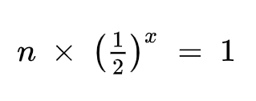
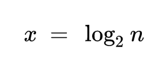

# 二分法查找

## 解释

折半查找，例如 `1-100`，要查找 75 
* 先将数据对法开，分为 `1-50` 和 `51-100`
* 75 在第二个 `51-100`，在将 `51-100` 分为 `51-76` 和 `76-100`
* 继续在 `51-76` 中查找，依次类推，找到 75

该方法仅在**有序列表**的方法下才有效

## 时间复杂度

`O(log n)`

把上面的步骤简化，`N` 个数如果要找到最终数字的话，最不理想的状态就是一直对半开查找，直到只剩最后一个数字，无法再继续查找，相当于执行了这么个过程 `N * 1/2 * 1/2 * .... = 1`，



所以



二分法的时间复杂度为 `O(log n)`

## 题目： [704. 二分查找](https://leetcode-cn.com/problems/binary-search/)

```js
给定一个 n 个元素有序的（升序）整型数组 nums 和一个目标值 target ，写一个函数搜索 nums 中的 target，如果目标值存在返回下标，否则返回 -1。

输入: nums = [-1,0,3,5,9,12], target = 9
输出: 4
解释: 9 出现在 nums 中并且下标为 4

/**
 * @param {number[]} nums
 * @param {number} target
 * @return {number}
 */
var search = function(nums, target) {
    // 空数组返回 -1
    let len = nums.length;
    if(len === 0) return -1;

    let midIndex = (len/2 === 0) ? (len/ 2 - 1) : (parseInt(len/2));
    let index = -1;
    if(target > nums[midIndex]) {
        // 目标值大于中间数
        index = search(nums.slice(midIndex + 1), target);
        if(index !== -1) {
            // 需要加上对应的坐标值
            index +=  midIndex + 1;
        }
    } else if(target < nums[midIndex]) {
        // 目标值小于于中间数
        index = search(nums.slice(0, midIndex), target);
    } else {
        // 刚好相等
        return midIndex;
    }

    return index;
};
```